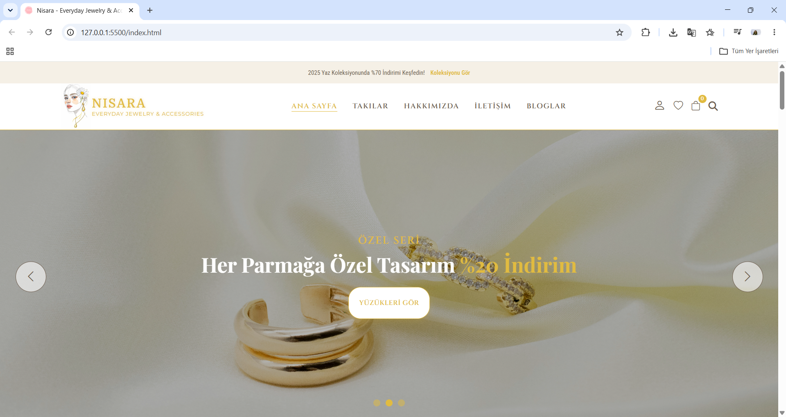
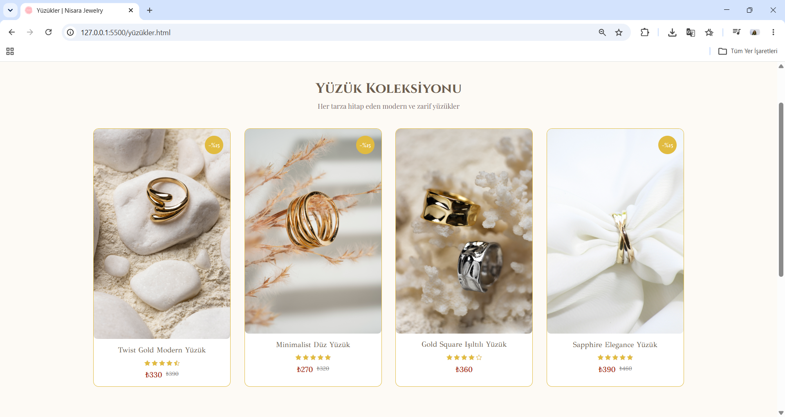
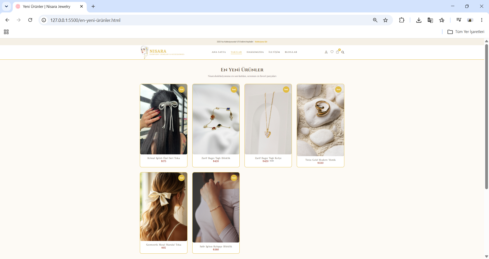
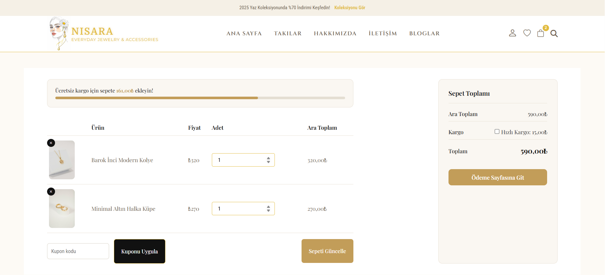
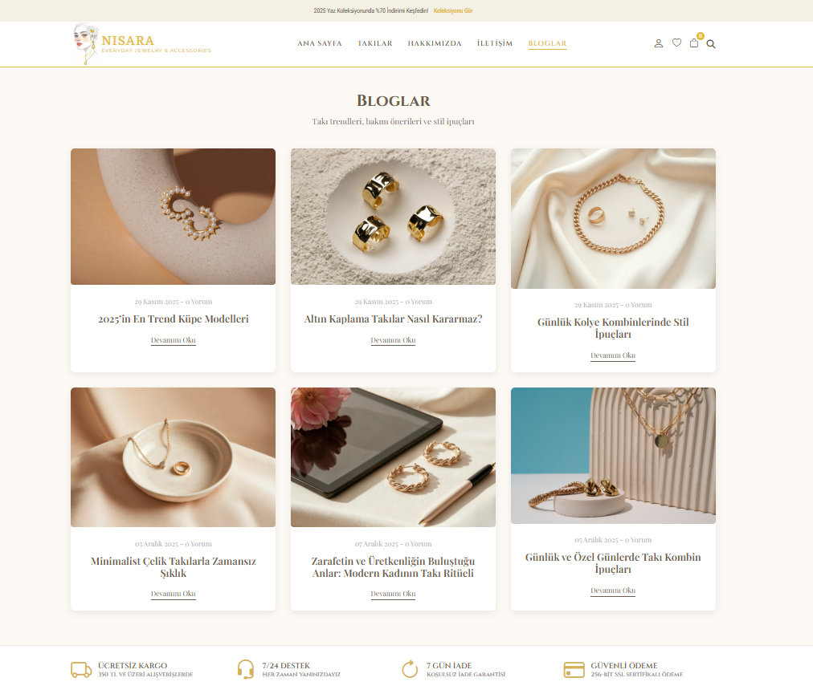
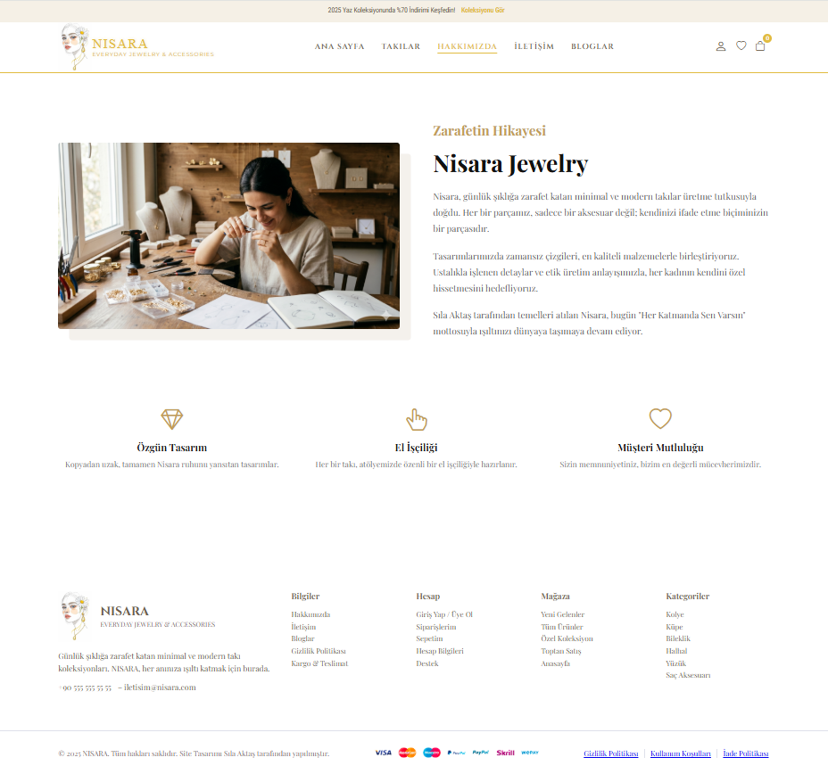

# 💎 Jewelry E-Commerce Frontend

A modern and responsive jewelry e-commerce frontend project built to provide an elegant and user-friendly online shopping experience.

## ✨ Overview

This project is a frontend implementation of a jewelry shopping website designed with a clean interface, responsive layout, and modern UI principles.

Users can explore products, browse collections, view product details, and navigate through different sections of the website.

## 🚀 Features

* Responsive design
* Modern e-commerce UI
* Product showcase pages
* Collection browsing
* Blog section
* Wishlist interface
* Shopping cart page
* Checkout page
* Clean component-based CSS structure
* Multi-page website architecture

## 🛠️ Technologies Used

* HTML5
* CSS3
* JavaScript
* Responsive Design
* Component-based styling

## 📂 Project Structure

```plaintext
Jewelry-E-Commerce-Frontend/
│
├── index.html
├── about.html
├── blog.html
├── cart.html
├── checkout.html
├── contact.html
│
├── css/
│   ├── base.css
│   ├── components/
│
├── js/
├── images/
└── README.md
```

## ⚙️ Installation

Clone the repository:

```bash
git clone https://github.com/slakts/Jewelry-E-Commerce-Frontend.git
```

Open the project:

```bash
cd Jewelry-E-Commerce-Frontend
```

Run locally:

```bash
Open index.html
```

## 📸 Screenshots

### Home Page


### Products



### Cart


### Blog


### About

```

## 🎯 Future Improvements

* Product filtering
* Search functionality
* Backend integration
* User authentication
* Payment integration
* Dark mode

## 📚 Learning Goals

This project was developed to improve:

* Frontend development skills
* Responsive web design
* Component organization
* UI/UX understanding

## 👩‍💻 Author

Developed by **Sıla Aktaş**

GitHub:
https://github.com/slakts

---

⭐ If you like this project, consider giving it a star.
